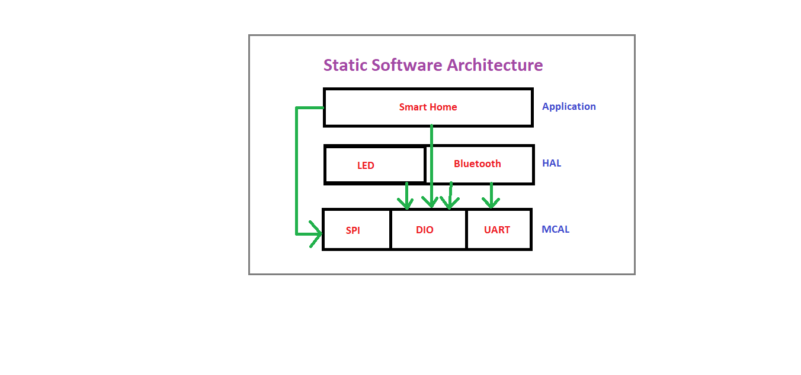
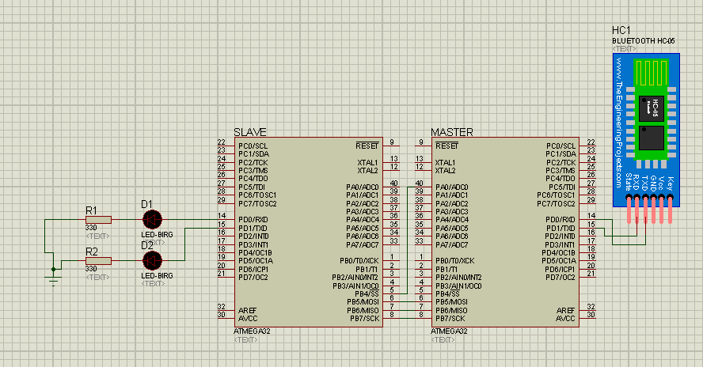

# Smart Home Application

Smart home application is a project based on ATMEGA32 and Bluetooth where we want to control home appliance wirelessly using Mobile App via Bluetooth.

## Project Description

- This project is Smart Home based on Bluetooth where we want to control home appliance wirelessly using Mobile App via Bluetooth.
- Two ECU’s Communicate with each other the first is a control ECU which takes the input from Bluetooth and sends it to the Sink (Actuator) ECU via SPI to interpret which action should be taken.

This project is developed using:

- Micro controller ATMEGA32
- Bluetooth HC-05
- Basic LEDs

## Bluetooth commands

- a: Turns on LED1.
- b: Turns off LED1.
- c: Turns on LED2.
- d: Turns off LED2.
- e: Toggles LED1.
- f: Toggles LED2.

#### Note: Make sure there are no line-ending letter being sent.

## Static Software Architecture

## Schematic

